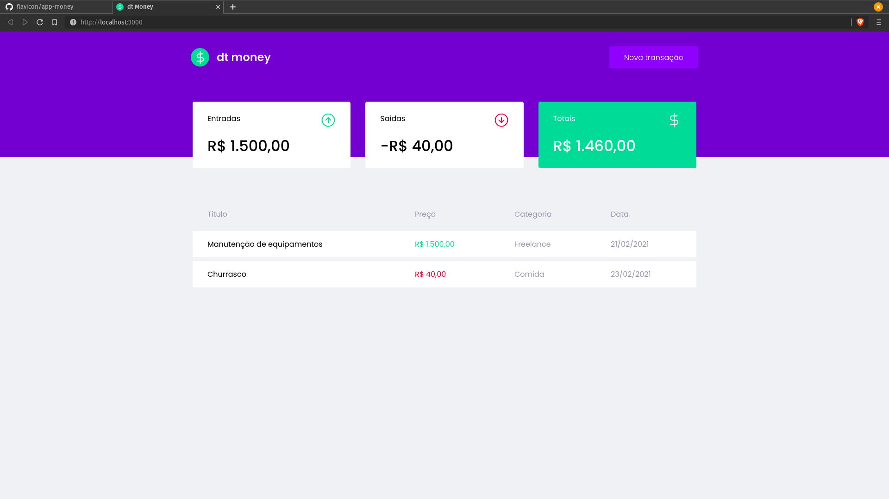
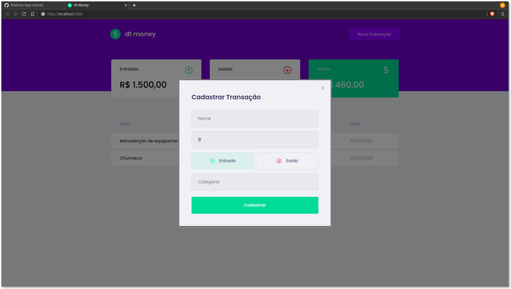

<h1 style="text-align: center">
dt mney  </h1>

<h2> :pushpin: O projeto consiste em uma aplicação para registrar transações financeiras, a aplicação mostra o total de receita em "Entradas",    &nbsp;total de despesas em "Saidas" e o Total. </h2>

<h3> Desenvolvido utilizando Reactjs, Styled-components, react-modal, miragejs e axios :rocket: </h3>

<h3> :octocat: Para executar o projeto localmente basta clonar este
repositório: </h3>

`git clone https://github.com/flavicon/app-money.git`

<h3> Acesse o diretório :open_file_folder: app-money </h3>

`cd app-money`

<h3> Instale todas as bibliotecas :books: presentes no projeto com o comando: </h3>

`yarn`

 <h3> Agora basta executar o projeto :tada: </h3>
 
 `yarn start`
 
  
